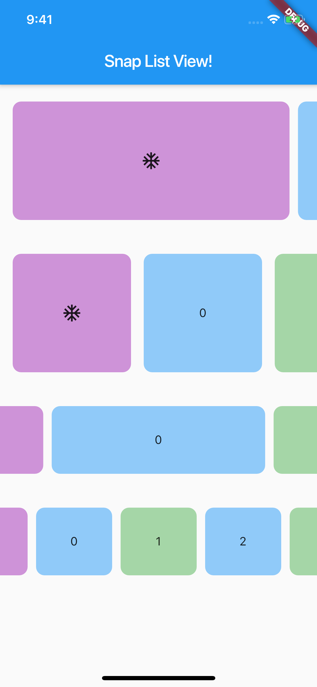

# Snap ListView, Smart Snap ListView

snap 기능을 가진 리스트 뷰

## How to Use

~~~dart
SnapListView(
    height : [HEIGHT],
    width : [WIDTH],
    children : [CHILDREN],
),
~~~

* Align Left
* Left Side =/= Right Side

~~~dart
SmartSnapListView(
    height : [HEIGHT], // double
    children : [CHILDREN], // List<Widget>
    count : [화면에 보여질 아이템 개수], // int
    factor : [아이템 가로 크기 비율], /// double [0.9~0.1]
),
~~~

* Align Center
* Left Side == Right Side

 

## Parameters

* **height** 
* **width**
* **children**
* dividerWidth
* topBottomMargin
* leftItemShowSize
* time
* firstLastSpace
* listBackColor

## Example

* 
* 
* 
